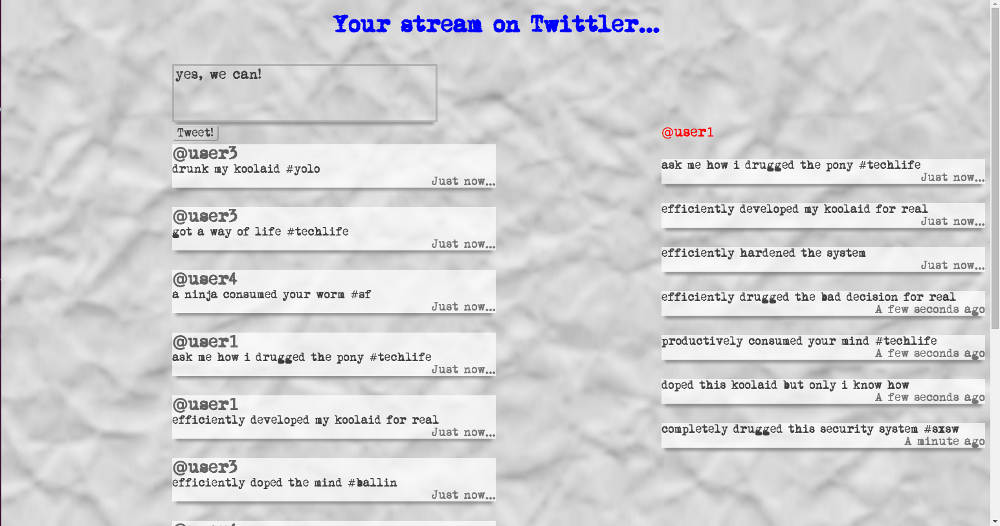

#twittler
This is a basic twitter style frontend application. A steady stream of randomized hipster tweets are generated with human like timestamps, and displayed on the crumpled paper UI. User can save their own tweets as well as visitors. Clicking on a user shows his/her tweets on the right side of the application.

Uses only jQuery, JavaScript functions, and HTML/CSS.

This project was built as an assignment at Hack Reactor.

